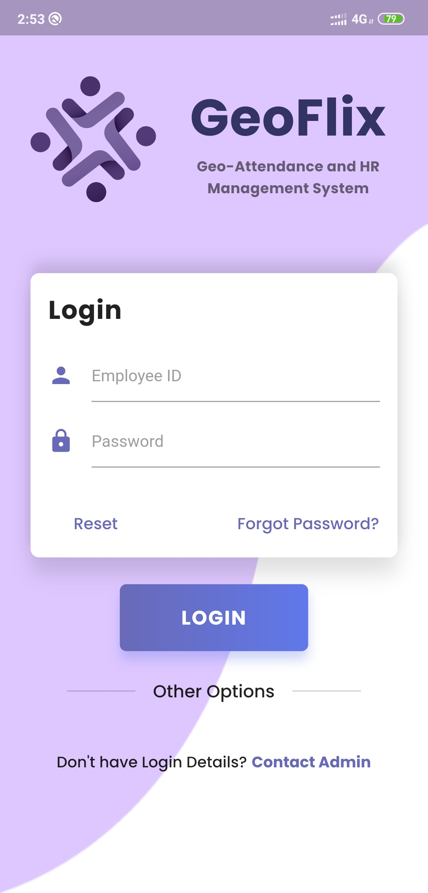
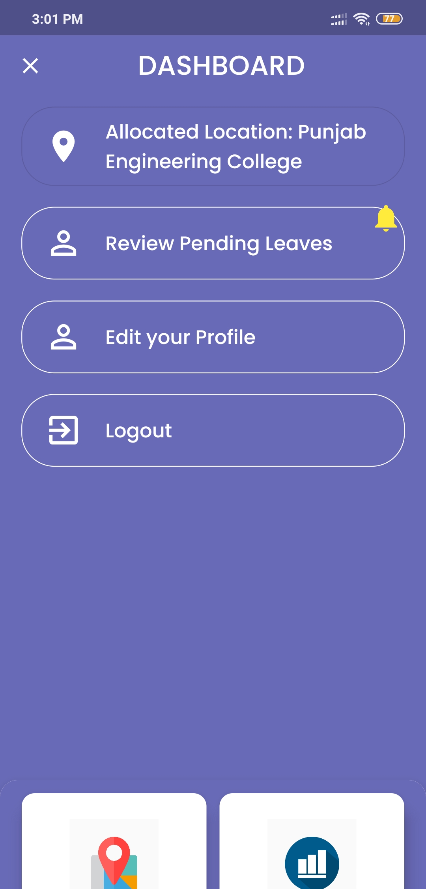
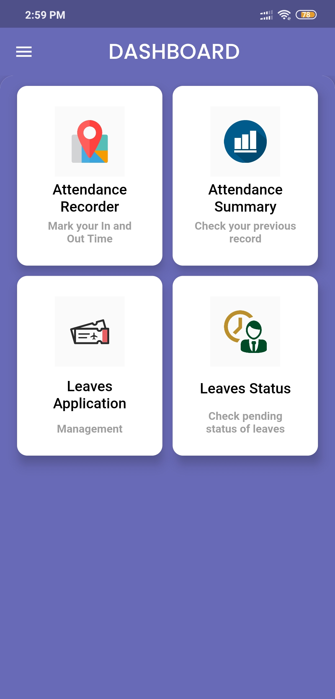
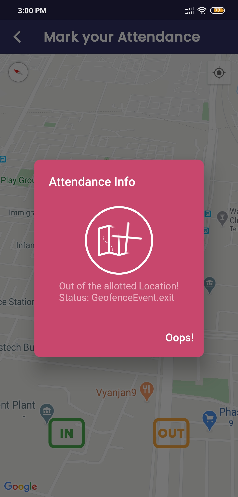
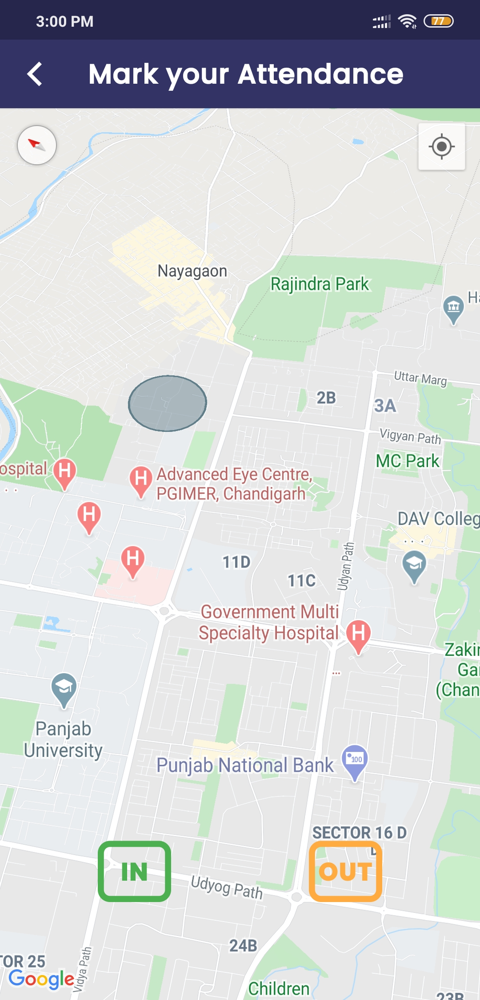
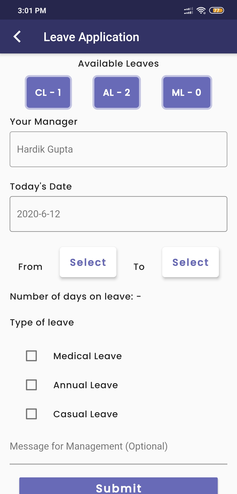
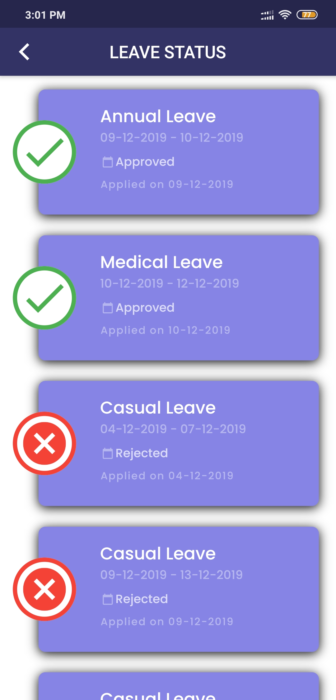
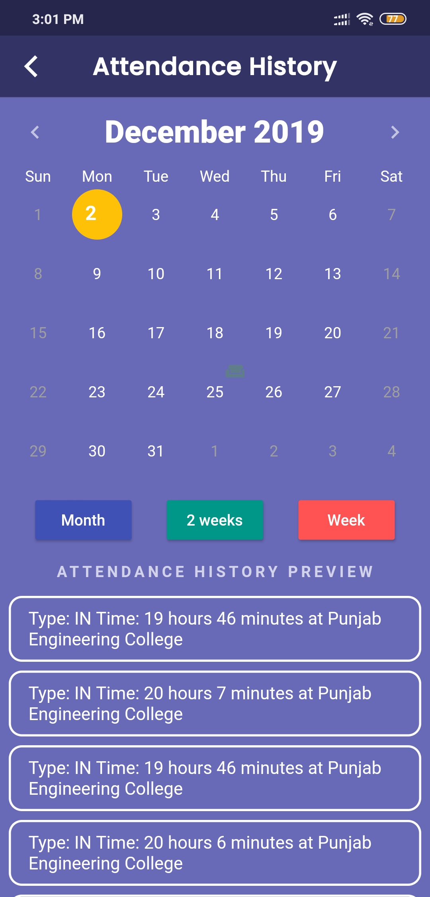

# Attendance system using Geo-fencing technology

- Our aim for this project is to develop an Application that can help
  both the employees and the employer in making the process of tracking
  attendance, leaves, and live location and recording of on-field
  worker’s attendance faster and more efficiently.
- By making use of an HR Management application, any organisation would
  greatly benefit by reducing error rate, decreased workload designated
  for the management of employees, as well as increase the efficiency of
  time and error rate for an organisation.

## Features Included

- **Employee Registration** – This feature will allow an employee to
  register a unique identity with the system. This also encompasses
  role-based access based on regular employee or administrator status.
- **Location-based Attendance** - This feature will allow employees to mark
  their attendance once the employee has reached his allocated office.
- **Leave Management** - This feature will allow employees to apply for
  leave and track its status.
- **Leave Approval/Rejection** - With each employee is an associated Manager, who can approve
or reject the leaves applied for, by an employee under him.
- **Cloud Notification** - Push Notifications on leave status change

### Admin Application
<a href="https://github.com/deepaktiwari88/HR-Management-and-Geo-Attendance-System-Admin-App">Link to Administrator Application</a>

## Running the Project

```
# Install the dependencies
flutter pub get

# Run the project
flutter run
```

## Screenshots


 &nbsp;  &nbsp;  &nbsp;  &nbsp;  &nbsp;  &nbsp;  &nbsp;  &nbsp; 

