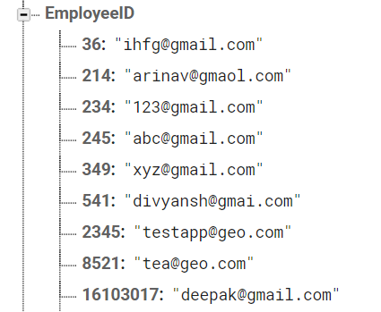
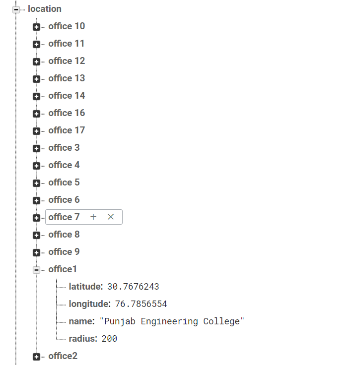
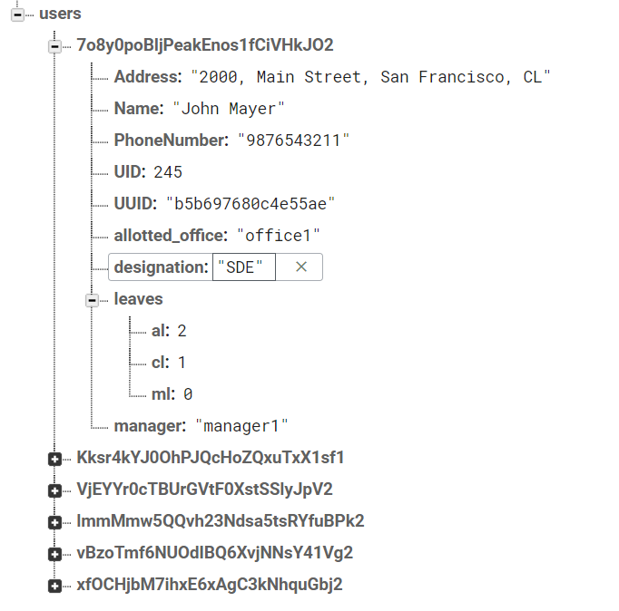
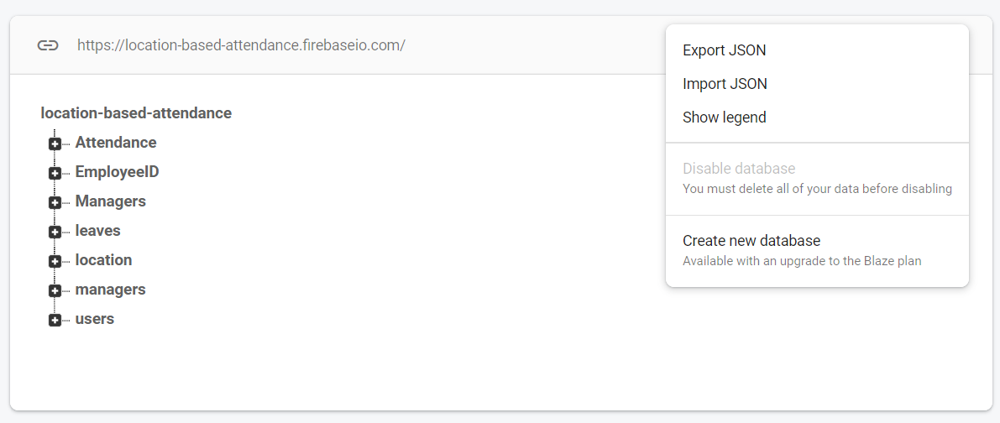

# Attendance system using Geo-fencing technology

- Our aim for this project is to develop an Application that can help
  both the employees and the employer in making the process of tracking
  attendance, leaves, and live location and recording of on-field
  worker’s attendance faster and more efficiently.
- By making use of an HR Management application, any organisation would
  greatly benefit by reducing error rate, decreased workload designated
  for the management of employees, as well as increase the efficiency of
  time and error rate for an organisation.

## Features Included

- **Employee Registration** – This feature will allow an employee to
  register a unique identity with the system. This also encompasses
  role-based access based on regular employee or administrator status.
- **Location-based Attendance** - This feature will allow employees to mark
  their attendance once the employee has reached his allocated office.
- **Leave Management** - This feature will allow employees to apply for
  leave and track its status.
- **Leave Approval/Rejection** - With each employee is an associated Manager, who can approve
or reject the leaves applied for, by an employee under him.
- **Cloud Notification** - Push Notifications on leave status change

### Admin Application
<a href="https://github.com/deepaktiwari88/HR-Management-and-Geo-Attendance-System-Admin-App">Link to Administrator Application</a>

## Setting Up the Project

### Firebase Console Set up
Add/Replace your google-services.json (downloadable from your firebase console) file into android/app directory. The project is built upon Real time database offered by Google Firebase. It is tailored right now according to our team needs. E.g. the login functionality is using an Employee ID, which we accomplished by mapping email ID to Unique ID (Employee ID). Enable the email authentication in the Auth Tab of Firebase Project.
<br> <br>
The Location of the various sites are stored in the Location Stub of RTDB with key as unique ID and parameters as
- latitude(double)
- longitude(double)
- name(string)
- radius(number in metres)

<br> <br>
Attendance will be added to the **"Attendance"** stub in the RTDB tree. Leave System has some specific parameters for every employee which is required to run the app.
<br> <br>
I will attach a JSON sample file(in the root directory) which you can use to prepopulate sample data in the RTDB using Import JSON feature.
<br> <br>
At last, Kindly update the google API key in the android manifest and enable the necessary Maps API on your API console. <a href="https://console.developers.google.com">Google Developer API console</a>

### Cloud Functions
Push Notifications has been enabled in the application to provide update regarding the Leave Application from Manager.
```
# Install firebase in the node environment
npm install -g firebase-tools

# Login into firebase 
firebase login

# Deploy the functions. Move to Cloud directory and perform this operation
firebase deploy
```
For more info, please refer: <a href="https://firebase.google.com/docs/functions/get-started">Firebase Cloud Functions</a>

## Running the Project

```
# Install the dependencies
flutter pub get

# Run the project
flutter run
```

## Screenshots


 &nbsp;  &nbsp;  &nbsp;  &nbsp;  &nbsp;  &nbsp;  &nbsp;  &nbsp; 

